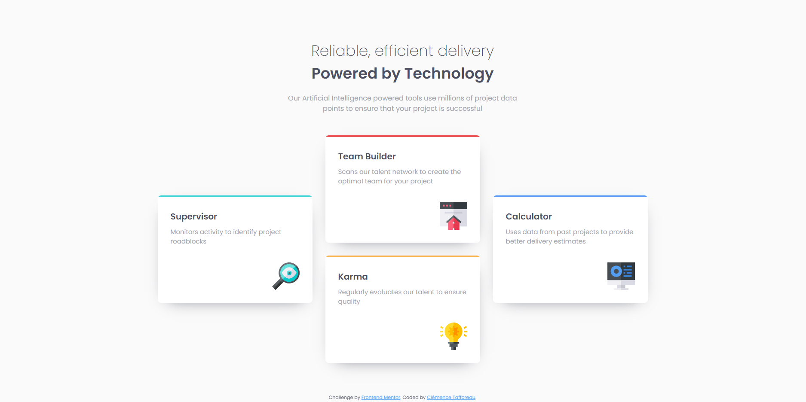

# Frontend Mentor - Four card feature section solution

This is a solution to the [Four card feature section challenge on Frontend Mentor](https://www.frontendmentor.io/challenges/four-card-feature-section-weK1eFYK). Frontend Mentor challenges help you improve your coding skills by building realistic projects. 

## Table of contents

- [Overview](#overview)
  - [The challenge](#the-challenge)
  - [Screenshot](#screenshot)
  - [Links](#links)
- [My process](#my-process)
  - [Built with](#built-with)
  - [What I learned](#what-i-learned)
  - [Useful resources](#useful-resources)
- [Author](#author)

## Overview

### The challenge

Users should be able to:

- View the optimal layout for the site depending on their device's screen size

### Screenshot

### Links

- Solution URL: [https://github.com/ClemenceTafforeau/Frontend-mentor-four-card-feature-component]
- Live Site URL: [https://clemencetafforeau.github.io/Frontend-mentor-four-card-feature-component/]

## My process

### Built with

- Semantic HTML5 markup
- CSS custom properties
- Flexbox
- CSS Grid
- Mobile-first workflow

### What I learned

I learned that, when adding color to a border, the colored border follows the curve of the border radius. I had to add a div, to which I added a background color, to achieve the desired look.

### Useful resources

- [Yoksel's SVG URL encoder]([https://yoksel.github.io/url-encoder/])

## Author

- Frontend Mentor - [@ClemenceTafforeau](https://www.frontendmentor.io/profile/ClemenceTafforeau)
